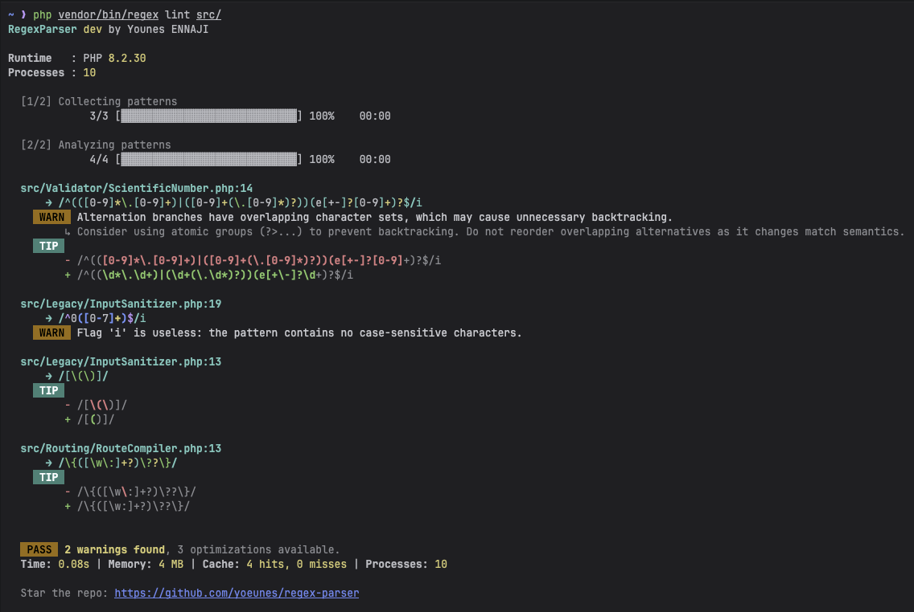

<p align="center">
    
</p>

<p align="center">
    <strong>Treat regular expressions as code.</strong>
</p>

<p align="center">
    <a href="https://www.linkedin.com/in/younes--ennaji"></a>
    <a href="https://github.com/yoeunes/regex-parser/releases"></a>
    <a href="https://github.com/yoeunes/regex-parser/blob/main/LICENSE"></a>
    <a href="https://packagist.org/packages/yoeunes/regex-parser"></a>
    <a href="https://github.com/yoeunes/regex-parser"></a>
    <a href="https://packagist.org/packages/yoeunes/regex-parser"></a>
</p>

---

# **RegexParser**: Parse, analyze, and learn **PCRE** in PHP

**RegexParser** is a PHP 8.2+ library that turns **PCRE** patterns into a typed **AST** and runs analysis through **visitors**. The goal is twofold: make regex approachable for newcomers and give tool authors a reliable foundation for validation, linting, and security analysis.

👉 **New to regex?** Start with the [Regex Tutorial](docs/tutorial/README.md) - no prior knowledge needed!

👉 **Need quick results?** Try the [Quick Start Guide](docs/QUICK_START.md) for immediate value.

## 🚀 Getting Started in 30 Seconds

```bash
# Install the library
composer require yoeunes/regex-parser

# Try the CLI
vendor/bin/regex explain '/\d{4}-\d{2}-\d{2}/'
```

## 🎯 What RegexParser Does

RegexParser helps you **understand, validate, and improve** regular expressions:

- ✅ **Parse** `/pattern/flags` into a structured AST
- ✅ **Validate** syntax and semantics with precise error locations
- ✅ **Explain** patterns in plain English
- ✅ **Analyze** ReDoS risk and suggest safer alternatives
- ✅ **Power** CLI linting for codebases and CI
- ✅ **Provide** a visitor API for custom tools

## 🔧 How It Works (Simple Explanation)

```
/^hello$/i
  |
  v
Lexer  -> TokenStream (breaks pattern into pieces)
Parser -> RegexNode (AST) (builds a tree structure)
          |
          v
       Visitors -> validation, explanation, analysis, transforms
```

**Want the full story?** See [How RegexParser Works](docs/ARCHITECTURE.md) for the complete architecture.

## 💻 CLI Quick Tour

```bash
# Parse and validate a pattern
vendor/bin/regex parse '/^hello world$/'

# Get plain English explanation
vendor/bin/regex explain '/\d{4}-\d{2}-\d{2}/'

# Check for security issues (ReDoS)
vendor/bin/regex analyze '/(a+)+$/'

# Colorize pattern for better readability
vendor/bin/regex highlight '/\d+/'

# Lint your entire codebase
vendor/bin/regex lint src/
```



## 📚 PHP API at a Glance

```php
use RegexParser\Regex;

$regex = Regex::create([
    'runtime_pcre_validation' => true,
]);

// Parse a pattern into AST
$ast = $regex->parse('/^hello world$/i');

// Validate pattern safety
$result = $regex->validate('/(?<=test)foo/');
if (!$result->isValid()) {
    echo $result->getErrorMessage();
}

// Check for ReDoS vulnerabilities
$analysis = $regex->redos('/(a+)+$/');
echo $analysis->severity->value; // 'critical', 'safe', etc.

// Get human-readable explanation
echo $regex->explain('/\d{4}-\d{2}-\d{2}/');
```

## 🔌 Integrations

RegexParser works seamlessly with your existing tools:

- **Symfony bundle**: [`docs/guides/cli.md`](docs/guides/cli.md)
- **PHPStan**: `vendor/yoeunes/regex-parser/extension.neon`
- **Rector**: Custom refactoring rules
- **GitHub Actions**: `vendor/bin/regex lint` in your CI pipeline

## Performance

RegexParser ships lightweight benchmark scripts in `benchmarks/` to track parser, compiler, and formatter throughput.

- Run formatter benchmarks: `php benchmarks/benchmark_formatters.php`
- Run all benchmarks: `for file in benchmarks/benchmark_*.php; do echo "Running $file"; php "$file"; echo; done`

## 📖 Documentation Roadmap

**For Beginners:**
- 🧑‍🎓 [Learn Regex from Scratch](docs/tutorial/README.md) - Complete tutorial
- 🚀 [Quick Start Guide](docs/QUICK_START.md) - Immediate results
- 📝 [Regex in PHP](docs/guides/regex-in-php.md) - PHP-specific details

**Key Concepts:**
- 🌲 [What is an AST?](docs/concepts/ast.md) - Abstract Syntax Tree explained
- 👣 [Understanding Visitors](docs/concepts/visitors.md) - How visitors work
- 🔒 [ReDoS Deep Dive](docs/concepts/redos.md) - Security vulnerabilities
- 🔤 [PCRE vs Other Engines](docs/concepts/pcre.md) - PHP's regex engine

**For Users:**
- 🔧 [CLI Guide](docs/guides/cli.md) - Full command reference
- 🍳 [Cookbook](docs/COOKBOOK.md) - Ready-to-use patterns
- 🔒 [ReDoS Guide](docs/REDOS_GUIDE.md) - Security best practices

**For Developers:**
- 🏗️ [Architecture](docs/ARCHITECTURE.md) - Internal design
- 🌲 [AST Reference](docs/nodes/README.md) - Node types
- 👣 [Visitors Reference](docs/visitors/README.md) - Custom analysis
- 🔧 [Extending Guide](docs/EXTENDING_GUIDE.md) - Build your own tools

**Reference:**
- 📚 [API Reference](docs/reference/api.md) - Complete documentation
- 🩺 [Diagnostics](docs/reference/diagnostics.md) - Error types
- ❓ [FAQ & Glossary](docs/reference/faq-glossary.md) - Common questions

## 🤝 Contributing

Contributions are welcome! See [`CONTRIBUTING.md`](CONTRIBUTING.md) to get started.

```bash
# Set up development environment
composer install

# Run tests
composer phpunit

# Check code style
composer phpcs

# Run static analysis
composer phpstan
```

## 🎯 Quick Summary

**RegexParser helps you:**
- ✅ **Understand** complex regex patterns with plain English explanations
- ✅ **Validate** patterns for syntax errors and security issues
- ✅ **Analyze** ReDoS vulnerabilities before they reach production
- ✅ **Visualize** pattern structure with AST diagrams
- ✅ **Build** custom regex analysis tools

**Perfect for:** Developers, security teams, educators, and anyone working with regular expressions in PHP.

## 📄 License

Released under the [MIT License](LICENSE).

<p align="center">
  <b>Made with ❤️ by <a href="https://www.linkedin.com/in/yoeunes/">Younes ENNAJI</a></b>
</p>

## 🚀 Ready to Start?

```bash
composer require yoeunes/regex-parser
bin/regex explain '/your-pattern-here/'
```
**Need help?** [Open an issue](https://github.com/yoeunes/regex-parser/issues) for support.

