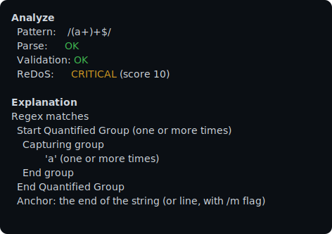
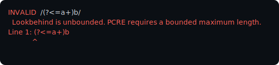

<p align="center">
    
</p>

<p align="center">
    <strong>Treat Regular Expressions as Code.</strong>
</p>

<p align="center">
    <a href="https://www.linkedin.com/in/younes--ennaji"></a>
    <a href="https://github.com/yoeunes/regex-parser/releases"></a>
    <a href="https://github.com/yoeunes/regex-parser/blob/main/LICENSE"></a>
    <a href="https://packagist.org/packages/yoeunes/regex-parser"></a>
    <a href="https://github.com/yoeunes/regex-parser"></a>
    <a href="https://packagist.org/packages/yoeunes/regex-parser"></a>
</p>

---

# RegexParser

RegexParser is a PHP 8.2+ PCRE regex parser that turns patterns into a typed AST.
It lets you validate, explain, lint, optimize, and analyze regexes for ReDoS risk, performance, and maintainability.

Built for library authors, framework teams, security and CI pipelines, and beginners who want to understand regexes as code.

## Why RegexParser

- Parse PCRE regex strings into a real AST (not regex-on-regex heuristics)
- Detect ReDoS risk with severity, hotspots, and recommendations
- Optimize and modernize patterns while preserving behavior
- Explain and highlight regexes for docs, reviews, and UIs
- CLI tooling plus Symfony and PHPStan integrations

## Quick Start (CLI first)

1) Install:

```bash
composer require yoeunes/regex-parser
```

2) Lint your codebase (fastest way to see value):

```bash
vendor/bin/regex lint src/
```

Find regexes in your project and report validation issues, ReDoS risk, and optimizations.

3) Inspect a single pattern:

```bash
vendor/bin/regex analyze '/(a+)+$/'
vendor/bin/regex highlight '/^[0-9]+(\w+)$/' --format=html
```

4) Validate in code:

```php
use RegexParser\Regex;

$regex = Regex::create();
$result = $regex->validate('/^[a-z0-9._%+-]+@[a-z0-9.-]+\.[a-z]{2,}$/i');

echo $result->isValid() ? "OK" : $result->getErrorMessage();
```

Want a human explanation? `Regex::explain()` turns a pattern into plain English.

More details: [CLI Guide](docs/guides/cli.md) and [Quick Start](docs/QUICK_START.md).

## CLI output previews





## Pick your path

Assume:

```php
use RegexParser\Regex;

$regex = Regex::create();
```

### Detect ReDoS

```php
use RegexParser\ReDoS\ReDoSSeverity;

$analysis = $regex->redos('/(a+)+b/');

if ($analysis->severity === ReDoSSeverity::CRITICAL) {
    echo "High risk of ReDoS attack!";
}
```

### Optimize

```php
$optimized = $regex->optimize('/[0-9]+/');

echo $optimized->original;   // /[0-9]+/
echo $optimized->optimized;  // /\d+/
```

Performance note: auto-possessivization is enabled by default in `optimize()`. Pass `['autoPossessify' => false]` if you need to preserve backtracking behavior.

### Generate samples

```php
$sample = $regex->generate('/[a-z]{3}\d{2}/');
```

### Caret diagnostics (runtime PCRE validation)

```php
use RegexParser\Regex;

$strict = Regex::create(['runtime_pcre_validation' => true]);
$result = $strict->validate('/(?<=a+)\w/');

if (!$result->isValid()) {
    echo $result->getErrorMessage().PHP_EOL;
    echo $result->getCaretSnippet().PHP_EOL;
    echo $result->getHint().PHP_EOL;
}
```

## Integrations

### Symfony

Run a unified lint across routes, validators, and code:

```bash
bin/console regex:lint --format=console
```

### PHPStan

Enable the PHPStan rule:

```neon
includes:
    - vendor/yoeunes/regex-parser/extension.neon
```

### CI (GitHub Actions)

```yaml
name: regex-lint
on: [pull_request]

jobs:
  regex:
    runs-on: ubuntu-latest
    steps:
      - uses: actions/checkout@v4
      - uses: shivammathur/setup-php@v2
        with:
          php-version: '8.2'
      - run: composer install --no-interaction --no-progress
      - run: vendor/bin/regex lint src/ --format=github
```

## Performance & caching

```php
use RegexParser\Regex;

$regex = Regex::create([
    'cache' => '/path/to/cache/dir',
    'max_pattern_length' => 100_000,
    'max_lookbehind_length' => 255,
    'runtime_pcre_validation' => false,
    'redos_ignored_patterns' => [
        '/^([0-9]{4}-[0-9]{2}-[0-9]{2})$/',
    ],
]);
```

## Docs

- Docs home: [docs/README.md](docs/README.md)
- Regex in PHP: [docs/guides/regex-in-php.md](docs/guides/regex-in-php.md)
- Regex Tutorial (zero to advanced): [docs/tutorial/README.md](docs/tutorial/README.md)
- Quick Start: [docs/QUICK_START.md](docs/QUICK_START.md)
- CLI Guide: [docs/guides/cli.md](docs/guides/cli.md)
- Diagnostics: [docs/reference/diagnostics.md](docs/reference/diagnostics.md)
- Diagnostics cheat sheet: [docs/reference/diagnostics-cheatsheet.md](docs/reference/diagnostics-cheatsheet.md)
- API reference: [docs/reference/api.md](docs/reference/api.md)
- FAQ and glossary: [docs/reference/faq-glossary.md](docs/reference/faq-glossary.md)
- Lint Rule Reference: [docs/reference.md](docs/reference.md)
- Reference index: [docs/reference/README.md](docs/reference/README.md)
- ReDoS Guide: [docs/REDOS_GUIDE.md](docs/REDOS_GUIDE.md)
- Cookbook: [docs/COOKBOOK.md](docs/COOKBOOK.md)
- Architecture: [docs/ARCHITECTURE.md](docs/ARCHITECTURE.md)
- AST traversal design: [docs/design/AST_TRAVERSAL.md](docs/design/AST_TRAVERSAL.md)
- AST nodes: [docs/nodes/README.md](docs/nodes/README.md)
- AST visitors: [docs/visitors/README.md](docs/visitors/README.md)
- External references: [docs/references/README.md](docs/references/README.md)
- Maintainers Guide: [docs/MAINTAINERS_GUIDE.md](docs/MAINTAINERS_GUIDE.md)
- Extending: [docs/EXTENDING_GUIDE.md](docs/EXTENDING_GUIDE.md)

<details>
<summary>Advanced: AST, visitors, and tooling</summary>

Assume `$regex = Regex::create();`.

### Work with the AST

```php
use RegexParser\Node\AlternationNode;
use RegexParser\Node\LiteralNode;

$ast = $regex->parse('/foo|bar/');
$pattern = $ast->pattern;

if ($pattern instanceof AlternationNode) {
    foreach ($pattern->alternatives as $branch) {
        foreach ($branch->children as $child) {
            if ($child instanceof LiteralNode) {
                echo "Literal: ".$child->value.PHP_EOL;
            }
        }
    }
}
```

### Write a custom visitor

```php
namespace App\Regex;

use RegexParser\Node\AlternationNode;
use RegexParser\Node\CharLiteralNode;
use RegexParser\Node\GroupNode;
use RegexParser\Node\LiteralNode;
use RegexParser\Node\QuantifierNode;
use RegexParser\Node\RegexNode;
use RegexParser\Node\SequenceNode;
use RegexParser\NodeVisitor\AbstractNodeVisitor;

/**
 * @extends AbstractNodeVisitor<int>
 */
final class LiteralCountVisitor extends AbstractNodeVisitor
{
    protected function defaultReturn(): int
    {
        return 0;
    }

    public function visitRegex(RegexNode $node): int
    {
        return $node->pattern->accept($this);
    }

    public function visitLiteral(LiteralNode $node): int
    {
        return 1;
    }

    public function visitCharLiteral(CharLiteralNode $node): int
    {
        return 1;
    }

    public function visitSequence(SequenceNode $node): int
    {
        $sum = 0;
        foreach ($node->children as $child) {
            $sum += $child->accept($this);
        }

        return $sum;
    }

    public function visitGroup(GroupNode $node): int
    {
        return $node->child->accept($this);
    }

    public function visitAlternation(AlternationNode $node): int
    {
        $sum = 0;
        foreach ($node->alternatives as $alternative) {
            $sum += $alternative->accept($this);
        }

        return $sum;
    }

    public function visitQuantifier(QuantifierNode $node): int
    {
        return $node->node->accept($this);
    }
}
```

Usage:

```php
$ast = $regex->parse('/ab(c|d)+/');
$count = $ast->accept(new LiteralCountVisitor()); // e.g. 4
```

### Optimize and recompile

```php
use RegexParser\NodeVisitor\CompilerNodeVisitor;
use RegexParser\NodeVisitor\OptimizerNodeVisitor;

$ast = $regex->parse('/(a|a)/');
$optimizedAst = $ast->accept(new OptimizerNodeVisitor());
$optimizedPattern = $optimizedAst->accept(new CompilerNodeVisitor());

echo $optimizedPattern; // /([a])/
```

### Auto-modernize legacy patterns

```php
use RegexParser\NodeVisitor\CompilerNodeVisitor;
use RegexParser\NodeVisitor\ModernizerNodeVisitor;

$ast = $regex->parse('/[0-9]+\-[a-z]+\@(?:gmail)\.com/');
$modern = $ast->accept(new ModernizerNodeVisitor())
    ->accept(new CompilerNodeVisitor());

echo $modern; // /\d+-[a-z]+@gmail\.com/
```

### Syntax highlighting

```php
use RegexParser\NodeVisitor\ConsoleHighlighterVisitor;
use RegexParser\NodeVisitor\HtmlHighlighterVisitor;

$ast = $regex->parse('/^[0-9]+(\w+)$/');

echo $ast->accept(new ConsoleHighlighterVisitor());
echo $ast->accept(new HtmlHighlighterVisitor());
```

### CLI install (PHAR)

```bash
curl -Ls https://github.com/yoeunes/regex-parser/releases/latest/download/regex.phar -o ~/.local/bin/regex && chmod +x ~/.local/bin/regex
```

Update the phar:

```bash
regex self-update
```

Build locally:

```bash
bin/build
```

The build requires `box` and `phar.readonly=0`.

</details>

## Versioning and BC

RegexParser follows Semantic Versioning:

- Stable for 1.x: `Regex` public API, result value objects, and core exception types
- May evolve in 1.x: AST node types and visitor interfaces

## Contributing

Contributions are welcome. Please run the full test suite before submitting a PR.

## License

This library is released under the [MIT License](LICENSE).

---

# Further Reading

- [RegexParser references](docs/references/README.md)
- [PCRE Specification](https://www.pcre.org/current/doc/html/pcre2syntax.html)
- [ReDoS Explained](https://owasp.org/www-community/attacks/Regular_expression_Denial_of_Service_-_ReDoS)

---

<p align="center"> <b>Made with ❤️ by <a href="https://www.linkedin.com/in/younes--ennaji/">Younes ENNAJI</a> </b> </p>
