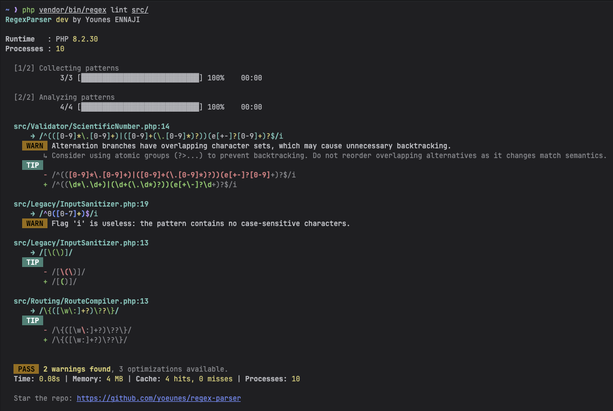

<p align="center">
    
</p>

<p align="center">
    <a href="https://github.com/yoeunes/regex-parser/actions/workflows/ci.yml"></a>
    <a href="https://phpstan.org/"></a>
    <a href="https://www.linkedin.com/in/younes--ennaji"></a>
    <a href="https://github.com/yoeunes/regex-parser/releases"></a>
    <a href="https://github.com/yoeunes/regex-parser/blob/main/LICENSE"></a>
    <a href="https://packagist.org/packages/yoeunes/regex-parser"></a>
    <a href="https://github.com/yoeunes/regex-parser"></a>
    <a href="https://packagist.org/packages/yoeunes/regex-parser"></a>
</p>

# RegexParser: Static Analysis, Linter & Logic Solver

RegexParser is a PHP 8.2+ library that treats regular expressions as code.

Unlike simple wrappers around `preg_match`, RegexParser implements a complete **compiler pipeline** (Lexer → Parser → AST) and an **Automata-based Logic Solver** (AST → NFA → DFA).

This architecture allows for advanced static analysis:
- **Linting:** Detect redundancy, useless flags, and common mistakes.
- **Safety:** Statically detect *potential* catastrophic backtracking (ReDoS).
- **Logic:** Compare patterns via NFA/DFA (Intersection, Equivalence, Subset) for the regular subset it supports.

Built for learning, validation, and robust tooling in PHP projects.

> ⚠️ **What this is and is not.** RegexParser is a side project and a learning
> exercise. It is **not** a hardened security product and should not be your
> only line of defense. ReDoS detection is structural and conservative — treat
> findings as *potential* risk to investigate, not as a guarantee of safety.
> The parser aims for PCRE compatibility but does not cover every edge case of
> the PCRE engine.

If you are new to regex, start with the [Regex Tutorial](docs/tutorial/README.md). If you want a short overview, see the [Quick Start Guide](docs/QUICK_START.md).

## Getting started

```bash
# Install the library
composer require yoeunes/regex-parser

# Try the CLI
vendor/bin/regex explain '/\d{4}-\d{2}-\d{2}/'
```

## What RegexParser provides

- 🏗️ **Deep Parsing:** Parse `/pattern/flags` into a structured, typed AST.
- 🧠 **Logic Solver:** Compare two regexes using NFA/DFA transformation (intersection, equivalence, subset). Works for patterns in the [regular subset](docs/ARCHITECTURE.md) it supports; falls back gracefully otherwise.
- 🛡️ **ReDoS Analysis:** Detect *potential* catastrophic backtracking risks structure-wise. Findings are heuristic — treat them as risk to investigate, not a guarantee.
- 🧹 **Linter:** Detect useless flags, redundant groups, and common mistakes via the CLI.
- 📖 **Explanation:** Explain patterns in plain English.
- 🔧 **Visitor API:** A flexible API for building custom regex tooling.

## Philosophy & Accuracy

RegexParser separates what it can guarantee from what is heuristic:

- Guaranteed: parsing, AST structure, error offsets, and syntax validation for the targeted PHP/PCRE version.
- Heuristic: ReDoS analysis is structural and conservative; treat it as potential risk unless confirmed.
- Context matters: PCRE version, JIT, and backtrack/recursion limits change practical impact.

### Tested against the real engine

Round-trip correctness (`compile(parse(x))` behaves like the original) is
verified in CI by differential tests that compare RegexParser's output against
PHP's native `preg_match()`:

- A fixture of **212 PCRE patterns** is checked for validity, match result,
  and captured groups (`OfficialPcreComplianceTest`).
- Additional behavioral tests cover named groups, lookarounds, conditionals,
  atomic groups, and other features (`BehavioralComplianceTest`,
  `AdvancedFeaturesComplianceTest`).

These tests compare against a limited set of subjects, so they catch clear
regressions but are **not** a formal proof of full PCRE equivalence. There may
be edge cases that the test suite does not yet cover.

Separately, the linter and ReDoS analyzer have been run over a corpus of
**~960 unique patterns collected from 279 real-world PHP projects** (Symfony,
Laravel, Composer, PHPUnit, …). The results are in `corpus/corpus.log` and
`corpus-redos.log`. This corpus run is **not** part of the automated CI
differential test — it is a snapshot used to validate that the lint and ReDoS
rules produce sensible output on real code.

## How to report a vulnerability responsibly

If you believe a pattern is exploitable:

1. Run confirmed mode and capture a bounded, reproducible PoC.
2. Include the pattern, input lengths, timings, JIT setting, and PCRE limits.
3. Verify impact in the real code path before filing a security issue.

See [SECURITY.md](SECURITY.md) for reporting channels.

## Safer rewrites (verify behavior)

These techniques reduce backtracking but can change matching behavior. Always validate with tests.

```
/(a+)+$/     -> /a+$/      (semantics often preserved, but verify captures)
/(a+)+$/     -> /a++$/     (possessive, no backtracking)
/(a|aa)+/    -> /a+/       (only if alternation is redundant)
/(a|aa)+/    -> /(?>a|aa)+/ (atomic, avoids backtracking)
```

## How it works

- `Regex::parse()` splits the literal into pattern and flags.
- The lexer produces a token stream.
- The parser builds an AST (`RegexNode`).
- Visitors walk the AST to validate, explain, analyze, or transform.

For the full architecture, see [docs/ARCHITECTURE.md](docs/ARCHITECTURE.md).

## CLI quick tour

```bash
# Parse and validate a pattern
vendor/bin/regex parse '/^hello world$/'

# Get plain English explanation
vendor/bin/regex explain '/\d{4}-\d{2}-\d{2}/'

# Check for potential ReDoS risk (theoretical by default)
vendor/bin/regex analyze '/(a+)+$/'

# Colorize pattern for better readability
vendor/bin/regex highlight '/\d+/'

# Lint your entire codebase
vendor/bin/regex lint src/
```



## PHP API at a glance

```php
use RegexParser\Regex;
use RegexParser\ReDoS\ReDoSMode;

$regex = Regex::create([
    'runtime_pcre_validation' => true,
]);

// Parse a pattern into AST
$ast = $regex->parse('/^hello world$/i');

// Validate pattern syntax and semantics
$result = $regex->validate('/(?<=test)foo/');
if (!$result->isValid) {
    echo $result->error;
}

// Check for ReDoS risk (theoretical by default)
$analysis = $regex->redos('/(a+)+$/');
echo $analysis->severity->value; // 'critical', 'safe', etc.

// Optional: attempt bounded confirmation
$confirmed = $regex->redos('/(a+)+$/', mode: ReDoSMode::CONFIRMED);
echo $confirmed->isConfirmed() ? 'confirmed' : 'theoretical';

// Get human-readable explanation
echo $regex->explain('/\d{4}-\d{2}-\d{2}/');
```

## Integrations

RegexParser integrates with common PHP tooling:

- **Symfony bundle**: [docs/guides/cli.md](docs/guides/cli.md)
- **PHPStan**: `vendor/yoeunes/regex-parser/extension.neon`
- **GitHub Actions**: `vendor/bin/regex lint` in your CI pipeline

## Performance

RegexParser ships lightweight benchmark scripts in `benchmarks/` to track parser, compiler, and formatter throughput.

- Run formatter benchmarks: `php benchmarks/benchmark_formatters.php`
- Run all benchmarks: `for file in benchmarks/benchmark_*.php; do echo "Running $file"; php "$file"; echo; done`

## Documentation

Start here:
- [Docs Home](docs/README.md)
- [Quick Start](docs/QUICK_START.md)
- [Tutorial](docs/tutorial/README.md)

Key references:
- [Architecture](docs/ARCHITECTURE.md)
- [API Reference](docs/reference/api.md)
- [Diagnostics](docs/reference/diagnostics.md)
- [FAQ & Glossary](docs/reference/faq-glossary.md)

## Contributing

Contributions are welcome! See [`CONTRIBUTING.md`](CONTRIBUTING.md) to get started.

```bash
# Set up development environment
composer install

# Run tests
composer phpunit

# Check code style
composer phpcs

# Run static analysis
composer phpstan
```

## License

Released under the [MIT License](LICENSE).

## Support

If you run into issues or have questions, please open an issue on GitHub: <https://github.com/yoeunes/regex-parser/issues>.
